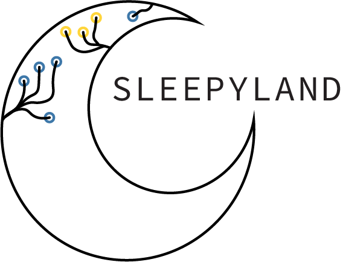
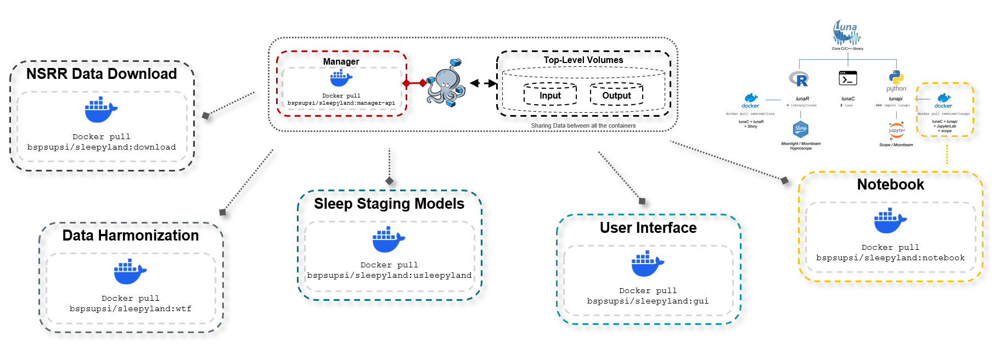

---

<div align="center">
  
</div>

---

<div align="center">A toolbox to fairly evaluate automatic sleep staging algorithms</div>

---

**SLEEPYLAND** is a Python-based web application developed for the automated FAIR sleep staging analysis of large sleep datasets. Utilizing state-of-the-art machine learning and deep learning models, SLEEPYLAND mainly simplifies sleep stage classification, empowering researchers and clinicians to analyse sleep recordings.

---

## Download & Run SLEEPYLAND

To get started, choose your operating system below. Just follow the step-by-step guideline. This is the recommended method as it allows you to visualize the installation process directly in the shell.

<div align="center">

|                                                                   **Linux**                                                                    |                                                                   **Mac**                                                                    |                                                                   **Windows**                                                                    |
|:----------------------------------------------------------------------------------------------------------------------------------------------:|:--------------------------------------------------------------------------------------------------------------------------------------------:|:------------------------------------------------------------------------------------------------------------------------------------------------:|
|  |  |  |
|                                           **Step 1**: [Download](./linux_setup.sh) `linux_setup.sh`                                            |                                          **Step 1**: [Download](./macos_setup.sh) `macos_setup.sh`                                           |                                             **Step 1**: [Download](./win_setup.ps1) `win_setup.ps1`                                              |
|                                       **Step 2**: [Download `docker-compose.yml`](./docker-compose.yml)                                        |                                      **Step 2**: [Download `docker-compose.yml`](./docker-compose.yml)                                       |                                        **Step 2**: [Download `docker-compose.yml`](./docker-compose.yml)                                         |
|                                          **Step 3**: Place the `.sh`/`.yml` files in the same folder.                                          |                                         **Step 3**: Place the `.sh`/`.yml` files in the same folder.                                         |                                          **Step 3**: Place the `.ps1`/`.yml` files in the same folder.                                           |
|                                         **Step 4**: Open a terminal, navigate to the folder, and run:                                          |                                        **Step 4**: Open a terminal, navigate to the folder, and run:                                         |                                  **Step 4**: Open PowerShell as Administrator, navigate to the folder, and run:                                  |
|                                                 `chmod +x linux_setup.sh && ./linux_setup.sh`                                                  |                                                `chmod +x macos_setup.sh && ./macos_setup.sh`                                                 |                                                                `./win_setup.ps1`                                                                 |

</div>

> ❗GOOD TO KNOW❗
> 
> Running `.sh` and `.ps1` scripts will also update SLEEPYLAND, automatically pulling the latest version of the shared Docker images.
    
>❗WARNING❗
> 
>**Windows Users:**
> SLEEPYLAND runs via Docker. Before running the script, ensure Docker Desktop is installed on your system. You can easily download it from [Docker's official website](https://www.docker.com/products/docker-desktop/).
>
> > *In the future, this step will be handled automatically.*
> 
> Once downloaded, check if Docker is installed and running by opening a terminal and typing:
> ```powershell
> docker --version
> ```
> If the command returns the Docker version, you are ready to proceed from the step 1.

> **Windows Users:**
>
> If you encounter issues running the `.ps1` script, you may need to change the PowerShell execution policy. To do this, open PowerShell as Administrator and run:
> ```powershell
> Set-ExecutionPolicy Unrestricted
> ```
> Confirm the change if prompted. This will allow the script to execute properly.

>❗WARNING❗
> 
> **SLEEPYLAND WebApp does not open automatically:**
> 
> **Ensure that all containers are running.**  
> You can check the status of your Docker containers by executing this command in your terminal:
> ```bash
> docker ps
> ```
> Look for a container named `gui` to confirm the `gui` service is up.
> 
> **Access SLEEPYLAND via your browser.**  
> Open your web browser and navigate to:
> ```plaintext
> http://localhost:8887
> ```
> This will open the SLEEPYLAND GUI where you can perform various tasks interactively.

>❗WARNING❗
> 
> **How to ``stop`` SLEEPYLAND:**
> 
> SLEEPYLAND runs in the background, even if you close the web window.  
> To completely stop the application, execute the following command in the terminal from the folder containing `docker-compose.yml`:
> ```bash
> docker compose -f docker-compose.yml -p sleepyland stop
> ```
> *In the future, we will add a feature to close the app directly from the web UI.*

>❗WARNING❗
> 
> If you are running the **SLEEPYLAND** software, please be aware that the application attempts to pull/install external software dependencies during its setup process. 
> 
> **Important Notice:**
> If you are operating on an institutional machine (e.g., hospital or university systems), this process is likely to fail due to permission restrictions. To avoid this issue, ensure you have the necessary administrative permissions or consult your IT department before proceeding with the installation.
---

## Key Features

<div align="center">

|                                            **Local Processing & Privacy**                                            |                                                                                                  **Fair Model Training**                                                                                                   |
|:--------------------------------------------------------------------------------------------------------------------:|:----------------------------------------------------------------------------------------------------------------------------------------------------------------------------------------------------------------------------:|
| All analyses run **locally on your device**, ensuring complete data **privacy**. Your data never leaves your laptop. | The included deep learning sleep staging models have been **fairly trained** and validated on consistent public datasets, ensuring **robust and reliable performance** for accurate sleep analysis and stage classification. |

> All the exposed sleep staging models run locally on your CPU (GPU support is not yet available). As a result, some models, such as the `deepresnet` and `sleeptransformer`model, may perform slowly when predicting or evaluating multiple combinations of EEG and EOG channels. We are actively working on optimizations and will release enhanced versions soon.

</div>

---

For instructions on navigating the UI and making the most of the analysis tools, check out this **[Quickstart Tutorial Video](https://supsi-my.sharepoint.com/:v:/g/personal/matteo_metaldi_supsi_ch/EW9iXTYxpoJOkOlV8-saDcsBZkSQMAh6zPMNDpo1frkDmw?nav=eyJyZWZlcnJhbEluZm8iOnsicmVmZXJyYWxBcHAiOiJPbmVEcml2ZUZvckJ1c2luZXNzIiwicmVmZXJyYWxBcHBQbGF0Zm9ybSI6IldlYiIsInJlZmVycmFsTW9kZSI6InZpZXciLCJyZWZlcnJhbFZpZXciOiJNeUZpbGVzTGlua0NvcHkifX0&e=n4sWts)**.

---

## List of Models for Sleep Staging

### Feature-Based Models for Sleep Staging

| **Model**        | **Description**                                                                                               | **Developed By**     | **References**                                             | **Available** |
|------------------|---------------------------------------------------------------------------------------------------------------|----------------------|-----------------------------------------------------------|---------------|
| **POPS (Luna)**   | A feature-based model for sleep stage classification using manually engineered features from PSG data.        | Luna Sleep Toolbox    | [Luna Resource](https://zzz.bwh.harvard.edu/luna/)      | ❌           |
| **YASA**          | A lightweight, open-source package for sleep staging, offering rapid sleep analysis using EEG/EOG/EMG signals. | Raphael Vallat, et al | Vallat R, Walker MP. [An open-source, high-performance tool for automated sleep staging.](https://doi.org/10.7554/eLife.70092) Elife. 2021. | ✅           |

**Note:** Feature-based models are used only for predictions and have not been retrained from scratch on datasets within the SLEEPYLAND context.

### Deep Learning Models for Sleep Staging

| **Model**       | **Description**                                                                                                               | **Developed By**                 | **References**                                                                                                                                                                                                              | **Available** |
|-----------------|-------------------------------------------------------------------------------------------------------------------------------|----------------------------------|-----------------------------------------------------------------------------------------------------------------------------------------------------------------------------------------------------------------------------|--------------|
| **U-Sleep**     | A robust deep learning model designed to handle various PSG setups and mixed-cohort datasets for automated sleep staging.      | Perslev, et al                   | Perslev M, Darkner S, et al. [U-Sleep: resilient high-frequency sleep staging.](https://doi.org/10.1038/s41746-021-00440-5) NPJ Digital Medicine. 2021.                                                                     | ✅          |
| **DeepResNet**  | A deep residual network model for high-frequency sleep stage classification using PSG data.                                    | Olesen, et al                    | Olesen AN, Jennum PJ, et al. [Automatic sleep stage classification with deep residual networks in a mixed-cohort setting.](https://doi.org/10.1093/sleep/zsaa161) Sleep. 2021.                                              | ✅          |
| **SleepTransformer** | A transformer-based model that provides sleep staging with interpretability and uncertainty quantification.                    | Phan, et al                      | Phan H, Mikkelsen K, et al. [Sleeptransformer: Automatic sleep staging with interpretability and uncertainty quantification.](https://doi.org/10.1109/TBME.2022.3147187) IEEE Transactions on Biomedical Engineering. 2022. | ✅          |
| **L-SeqSleepNet** | L-SeqSleepNet: Whole-cycle Long Sequence Modeling for Automatic Sleep Staging.                    | Phan, et al                      | Phan H, Lorenzen KP, et al. [L-SeqSleepNet: Whole-cycle Long Sequence Modeling for Automatic Sleep Staging.](https://doi.org/10.1109/JBHI.2023.3303197) IEEE Journal of Biomedical and Health Informatics. 2023.            | ❌          |

All models have been implemented to ensure consistency and fairness in their evaluation on the NSRR datasets. Additionally, all models are now available in a single-channel configuration (EEG or EOG) and in the multi-channel configuration (EEG+EOG), offering flexibility to match user data and requirements.

---

> **Need additional help?** Click the **[Quickstart Tutorial](./notebook/src/sleepyland-notebooks/quickstart_tutorial.ipynb)** button for detailed step-by-step instructions.

---

## Technical Section

<details>
  <summary><strong>Datasets</strong></summary>

<div style="border: 1px solid #ccc; padding: 10px; border-radius: 5px; margin-top: 10px;">

  <strong>NSRR Datasets Included for Model Train/Valid/Test</strong>
  <br />

  | Dataset      | Subject Count | PSG Count | Age (µ ± σ)   | Sex %M | BMI (µ ± σ)   | Sleep Disorders | Annotation Format | **Included** |
  |--------------|---------------|-----------|----------------|--------|----------------|------------------|-------------------|--------------|
  | [ABC](https://sleepdata.org/datasets/abc) | 49            | 132       | 48.8 ± 9.9     | 57.1   | 38.9 ± 3.0     | OSA              | .xml              | ✅            |
  | [APOE](https://sleepdata.org/datasets/apoe) | 712           | 712       | 45.7 ± 13.6    | 59.1   | 27.2 ± 6.5     | SDB              | .STA              | ❌            |
  | [APPLES](https://sleepdata.org/datasets/apples) | 1094          | 1094      | 50.1 ± 12.9    | 63.2   | 32.1 ± 7.8     | OSA              | .annot            | ❌            |
  | [CCSHS](https://sleepdata.org/datasets/ccshs) | 515           | 515       | 17.7 ± 0.4     | 50.5   | 25.1 ± 5.9     | SRMD             | .xml              | ✅            |
  | [CFS](https://sleepdata.org/datasets/cfs) | 144           | 730       | 41.4 ± 19.3    | 44.8   | 32.4 ± 9.5     | OSA              | .xml              | ✅            |
  | [CHAT](https://sleepdata.org/datasets/chat) | 1232          | 1638      | 7.0 ± 1.4      | 48.3   | 19.0 ± 4.9     | OSA              | .xml              | ✅            |
  | [HOMEPAP](https://sleepdata.org/datasets/homepap) | 246           | 246       | 46.5 ± 11.9    | 60.3   | 37.2 ± 8.9     | OSA              | .xml              | ✅            |
  | [MESA](https://sleepdata.org/datasets/mesa) | 2056          | 2056      | 69.9 ± 9.2     | 46.4   | 28.7 ± 5.6     | SDB              | .xml              | ✅            |
  | [MNC_CNC](https://sleepdata.org/datasets/mnc_cnc) | 78            | 78        | 28.5 ± 16.9    | 51.3   | 23.2 ± 11.5    | NT1, NT2, IH     | .xml              | ❌            |
  | [MNC_DHC](https://sleepdata.org/datasets/mnc_dhc) | 83            | 83        | 33.4 ± 14.8    | 50.0   | 24.8 ± 4.9     | -                | .xml              | ❌            |
  | [MNC_SSC](https://sleepdata.org/datasets/mnc_ssc) | 767           | 767       | 45.4 ± 13.8    | 59.4   | 23.9 ± 6.5     | -                | .xml              | ❌            |
  | [MROS](https://sleepdata.org/datasets/mros) | 2905          | 3930      | 76.4 ± 5.5     | 100    | 27.2 ± 3.9     | SDB              | .xml              | ✅            |
  | [MSP](https://sleepdata.org/datasets/msp) | 105           | 105       | 26.8 ± 5.9     | 0      | 42.4 ± 6.6     | SDB              | .annot            | ❌            |
  | [NCHSDB](https://sleepdata.org/datasets/nchsdb) | 3651          | 3950      | 8.8 ± 5.9      | 56.3   | 22.7 ± 9.9     | -                | .tsv              | ❌            |
  | [SHHS](https://sleepdata.org/datasets/shhs) | 5797          | 8444      | 63.1 ± 11.2    | 47.6   | 28.2 ± 5.1     | OSA, SDB         | .xml              | ✅            |
  | [SOF](https://sleepdata.org/datasets/sof) | 453           | 453       | 82.9 ± 3.2     | 0      | 27.7 ± 4.6     | SDB              | .xml              | ❌            |
  | [WSC](https://sleepdata.org/datasets/wsc) | 1123          | 2569      | 56.4 ± 8.1     | 54.1   | 31.7 ± 7.1     | SDB              | .txt              | ❌            |

  
  <strong>Open Access Datasets Included for Model Testing</strong>
  <br />

  | Dataset      | Subject Count | PSG Count | Age (µ ± σ)   | Sex %M | BMI (µ ± σ)   | Sleep Disorders | Annotation Format | **Included** |
  |--------------|---------------|-----------|----------------|--------|----------------|------------------|-------------------|--------------|
  | [DCSM](https://sid.erda.dk/wsgi-bin/ls.py?share_id=fUH3xbOXv8) | 255           | 255       | -              | -      | -              | -                | .ids              | ❌            |
  | [PHYS](https://physionet.org/content/challenge-2018/1.0.0/) | 994           | 994       | 55.2 ± 14.3    | 67     | -              | SDB              | .ids              | ❌            |
  | [SEDF_SC](https://physionet.org/content/challenge-2018/1.0.0/) | 78            | 153       | 58.8 ± 22.0    | 47     | -              | -                | .edf              | ❌            |
  | [SEDF_ST](https://physionet.org/content/challenge-2018/1.0.0/) | 22            | 44        | 40.2 ± 17.7    | 32     | -              | -                | .edf              | ❌            |
  | [ISRUC](https://sleeptight.isr.uc.pt/?page_id=48) | 100           | 100       | 51.1 ± 13.7    | 35.2   | 25.0 ± 5.8     | -                | .xml              | ❌            |


</div>

**Note:** All deep learning-based models for sleep staging have been trained, validated, and tested on the datasets marked with a ✅.
</details>

<details>
  <summary><strong>Architecture</strong></summary>
  <div style="border: 1px solid #ccc; padding: 10px; border-radius: 5px; margin-top: 10px;">
    <strong></strong><br />
  <div align="center">
    
  </div>
  </div>
<br />

</details>

<details>
  <summary><strong>Ensemble Metrics</strong></summary>
  <div style="border: 1px solid #ccc; padding: 10px; border-radius: 5px; margin-top: 10px;">
  </div>
<br />

</details>

---

## Getting Started with SLEEPYLAND

Follow these steps to kickstart your sleep staging data analysis journey on supported [Datasets](#technical-section). 

> The user has three main options to perform the sleep staging via the UI:
>
> 🟢 **[NSRR Data](#-nsrr-data)**: Benchmark and compare different sleep staging models using NSRR recordings. This option allows you to evaluate the performance of various models on standardized datasets.
>
> 🟢 **[MyEDF Data](#-myedf-data)**: Analyze/Predict your own recordings (user-provided `.edf` files) while ensuring complete data privacy and security.
> 
> 🔴 **Open Access Data**: Exploit commonly used open-access datasets to benchmark and compare different sleep staging models (_still not supported_). 

---

### 🟢 NSRR Data

---

#### Upload/Download Data

- **Upload** 
 
  When uploading NSRR data, ensure your dataset follows the hierarchical structure below for SLEEPYLAND to recognize and organize files correctly:
  
  Example structure for a dataset named **learn**:
 
      **learn** 
      ├── `learn-nsrr01.edf`  
      ├── `learn-nsrr01.xml`
      ├── `learn-nsrr02.edf`  
      ├── `learn-nsrr02.xml`  
      ├── `learn-nsrr03.edf`  
      └── `learn-nsrr03.xml`

- **Download Data**

  - Insert a token obtained via the [NSRR data request platform](https://sleepdata.org/data/requests/nfs/start).
    - Select the desired dataset among the ones supported in SLEEPYLAND.
    - Choose the specific NSSR recording/s.  

#### Specify Channels
- **Single-channel configuration:** Choose either EEG or EOG (set the other to "None").  
- **Multi-channel configuration:** Choose both EEG and EOG set of channels (e.g., EEG: `C4-M1`, EOG: `E1-M2`).  

> Note: Specify also the name of the folder where outcomes will be saved (the folder will be created under the shared volume output).

#### Models for Sleep Staging
Select a set of models for sleep staging:  
- Feature-based models  
- Deep learning-based models.

For details, see the [List of Models for Sleep Staging](#list-of-models-for-sleep-staging) section.  

#### Run Evaluations
Once configurations are set, choose the **Evaluate** option (since supported NSRR data includes annotation files).  

#### Explore Results
Explore results using:  
- **UI Options** for interactive visualization.  
- **Notebook Option** for advanced analysis using Python and Jupyter Notebooks.

---

### 🟢 MyEDF Data

---

#### Upload Data
- Upload a `.edf` file and optionally an annotation file.

#### Specify Channels
- **Channel type options:**  
  - EEG only  
  - EOG only  
  - EEG and EOG (multi-channel).  
- If mastoid channels are present, select the re-reference option.  

> Note: Specify also the name of the folder where outcomes will be saved (the folder will be created under the shared volume output).

#### Models for Sleep Staging
Select a set of models for sleep staging:  
- Feature-based models  
- Deep learning-based models.

For details, see the [List of Models for Sleep Staging](#list-of-models-for-sleep-staging) section.  

#### Run Predictions/Evaluations
- Choose **Predict** if only `.edf` files were uploaded.  
- Choose **Evaluate** if an annotation file is also provided.  

#### Explore Results
Explore results using:  
- **UI Options** for interactive visualization.  
- **Notebook Option** for advanced analysis using Python and Jupyter Notebooks.

---
